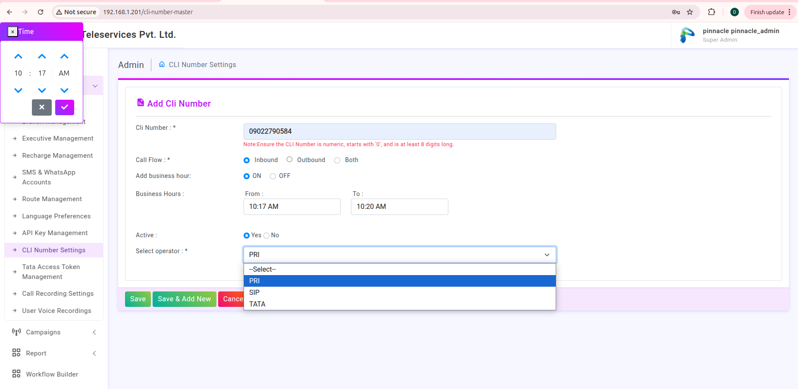
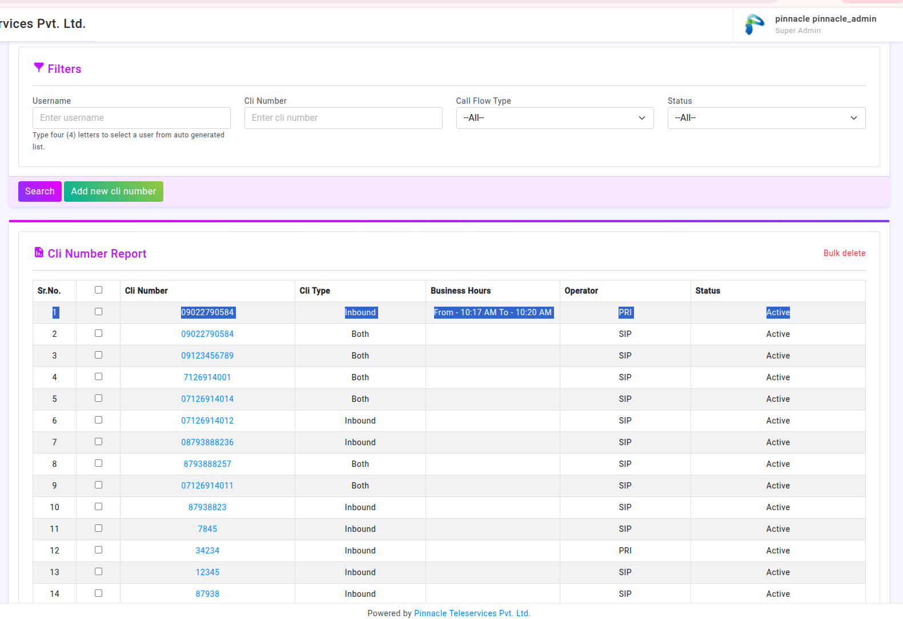
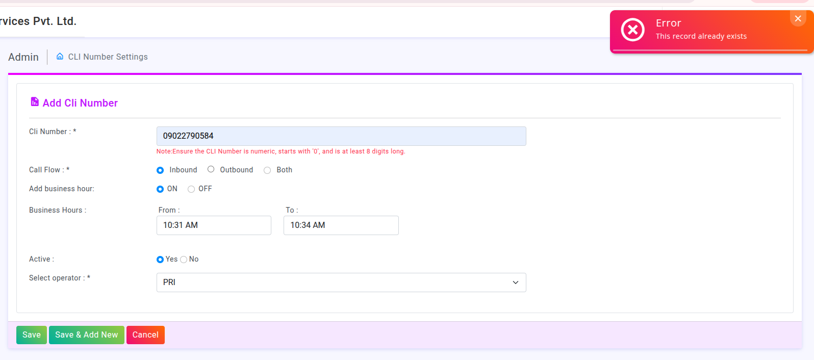
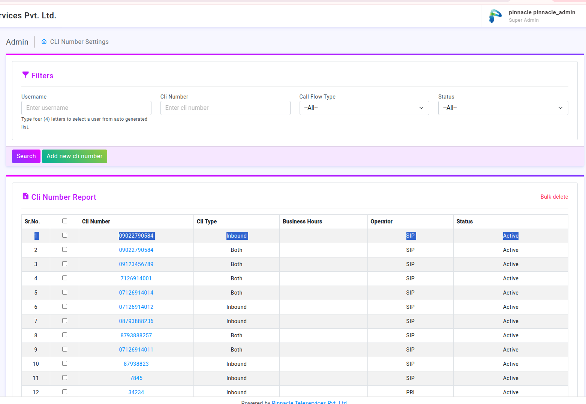
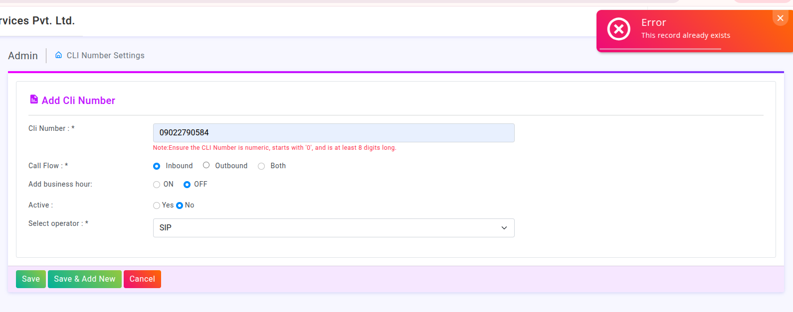
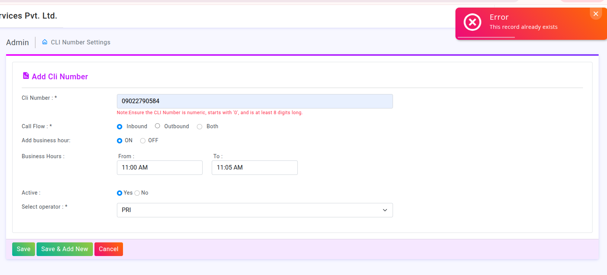
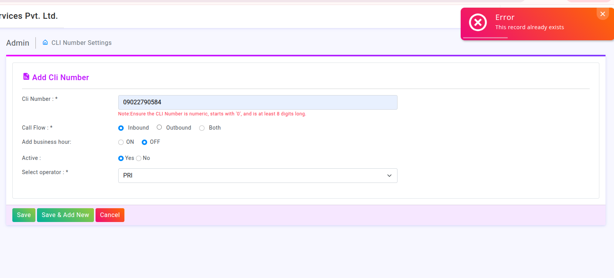

#  CLI Number Setting Introduction
CLI Number : Caller line Identification  
   This number used for calling either inbound or outbound or both.
The number must be numeric and should start with ‘0’ ,and at least 8 digit.

Example : 

### Call Flow :
 	It contain 3 options :-
    1) Inbound -> It simply means we can only receives call for example 					  customer support helpline number (1800-123-4567),etc.

    2) Outbound -> means we can only make calls for example 

    3) Both -> the number which for both inbound and outbound for example business helpline. Set as Both to handle calls in both directions.

### Add Buiseness Hour :

There are 2 Options :
    1. ON - The number only works during business hours for example 
9 AM - 6PM. Bank help line number (shift wise)

    2. OFF : The number works 24/7, including nights and weekends for 			example emergency service number.

### Active Status :
 These functionality include 2 section : 
    a) YES : - It means the number is active and ready to use.
    b) NO :- It means is inactive exm the number is not in use but save in   			 the system.
     Example : If a user stop using a number the company deactive the 		number instaed of deleting the number.

### Select Operator :- These include 3 following options 
    1) PRI : It is used by large buiseness exm., a call center with 30 fixed 			 landline number.
    2) SIP : System generated call.
    3) TATA : 

    
    

Same CLI number with same operator not added , But with the different operator and same CLI number added successfully.

We can do edit also like change 

Conditions For adding new CLI number :
    ## 1. Same CLI number added having these different feature 
        #### a) With different Call Flow:
            i. Inbound
            ii. Outbound
            iii. Both

            
        #### b) Add Business hour should be same staus 
            i. ON
            ii. OFF
            when it differe and want to add new CLI number it says “record already exist.” 

        #### c) CLI number Activation Status shopuld be same when it differe it says that “record already exist.”

        

        #### d) When Adding new CLI number teh SELECT Operator having 3 	options :
            i. PRI  :- It stand for Primary Rate Interface that If we have a PRI from Airtel, you request them to map the new number to our PRI trunk.
            ii. SIP  :- It stands for Session Initiation Protocol i.e.  
            iii. TATA :-