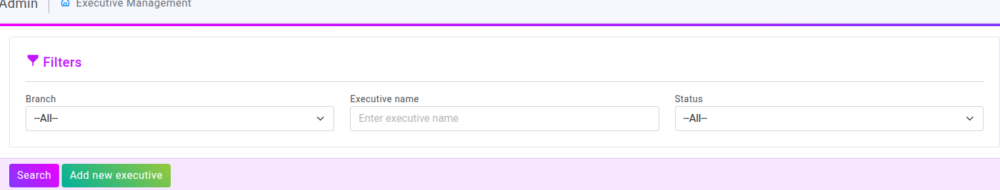
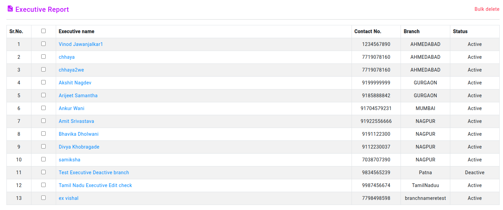
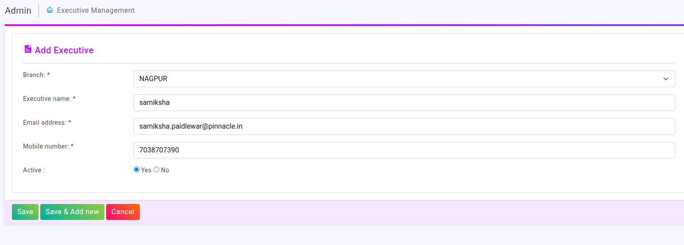
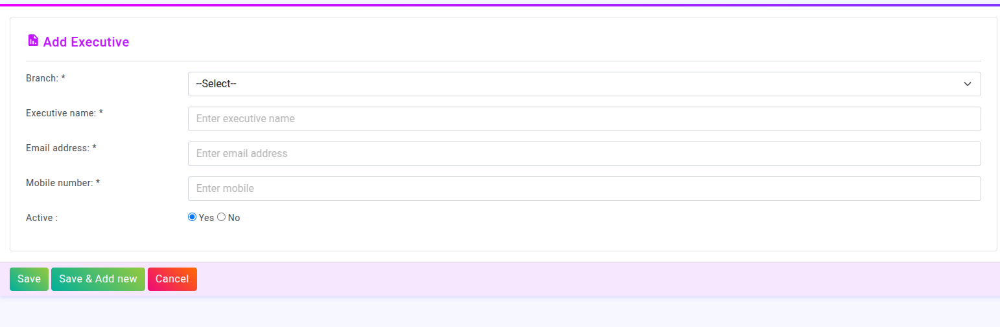

# Introduction to Executive Management 

Executive Management :
--
The Executive Management Panel is a part of the Superadmin dashboard designed to help manage executives effectively. It offers filtering options by branch, executive name, and status, making it easy to search and organize information quickly. Additionally, there’s an "Add New Executive" feature, allowing administrators to effortlessly register new executives along with
this, the dashboard includes an executive report, where exicutive can edit or delete a particular executive. There is also a bulk delete option for managing multiple executives at once.

---
Filters:
---
This section allows to filter and search for executives based on
different criteria.

---
 Branch Dropdown :
---
In this section we can select a particular branch from the
dropdown menu to filter executive.

---
Executive name :
---

A text field where we can enter an executive’s name to search for a specific person. 

---
Status Dropdown :
---

A dropdown that allows users to filter executives based on their status (e.g., Active, Inactive). 

---
Action Buttons :
---

---
"Search" Button :
---
When clicked, it triggers a search operation based on the selected filters. 

---
"Add new executive" Button :
---
This button allows admins to add a new executive to the system. 

---
Executive Report :
---

This section allows you to view all executive reports

---
Edit : 
---

In this reports edit and delete option also available for particular executive

Add Executive: This clearly states the purpose of the form is to update new executive profile.

Branch: A dropdown menu showing the executive's current branch (NAGPUR). The executive can change this to a different branch

Executive Name: The executive's name (samiksha). This field is editable,. , the executive can correct spelling or update a name change.

Email Address: The executive's email address (samiksha.paidlewar@pinnacle.in). This field is editable.

Mobile Number: The executive's mobile number (7038707390). This field is editable

Active: Radio buttons indicating whether the executive's profile is active (currently "Yes").

Save: Saves the changes made to the executive's information.

 Save & Add New: It likely saves the current changes and then redirects to a blank "Add Executive" form, allowing the administrator to immediately add a new executive after updating the current one.

Cancel: Cancels the update operation, discarding any changes .
 
---
Bulk Delete : 
---
A bulk delete option allows  to delete multiple items or records at once, instead of deleting them individually.

---
Add New Executive :
---

In this form we can add new executive 

Branch:
--
In this Executive form, there is a dropdown menu for selecting a branch.

Executive Name:
--
A text field where we can enter the executive's name.

Email Address:
--
A text field where we can enter the executive's email address.

Mobile Number:
--
A text field where we can enter the executive's mobile number.

Active:
--
A section with two radio buttons for selecting "Yes" or "No" to indicate whether the executive is active.