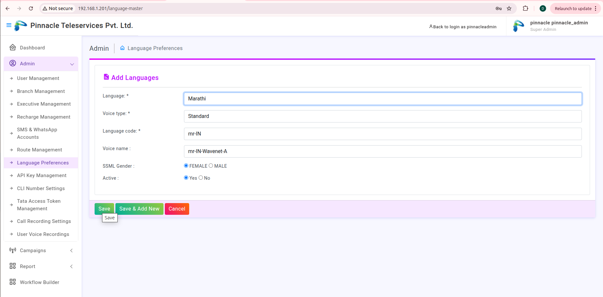
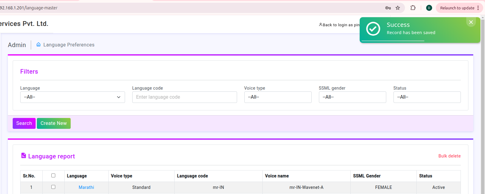
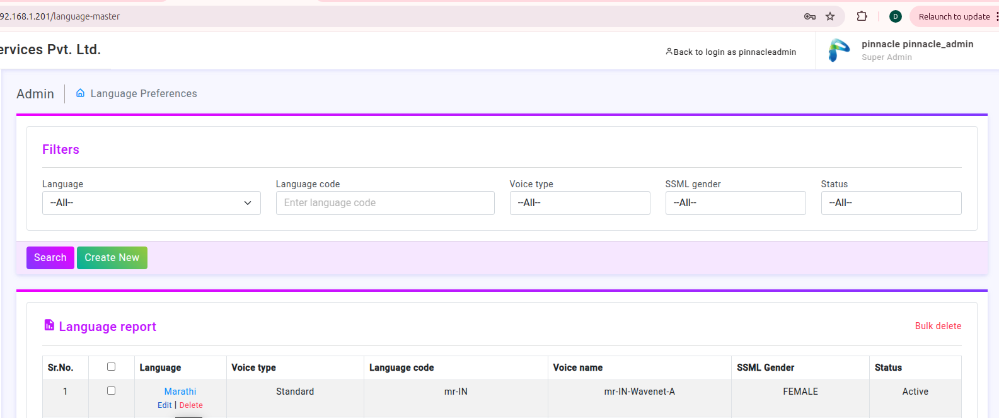
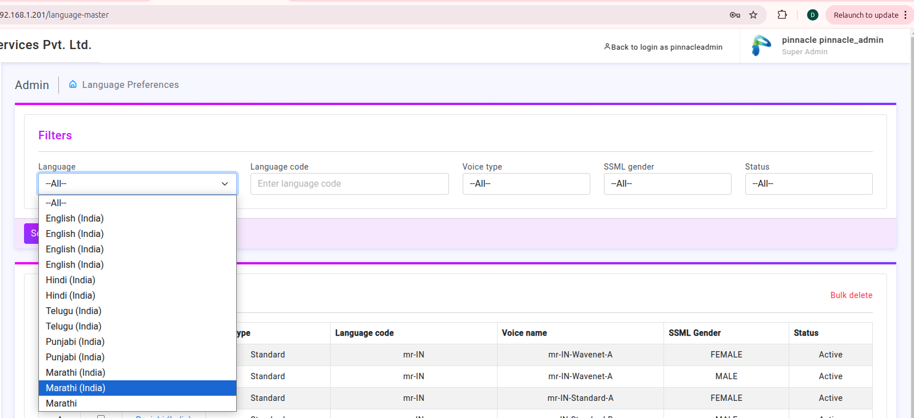
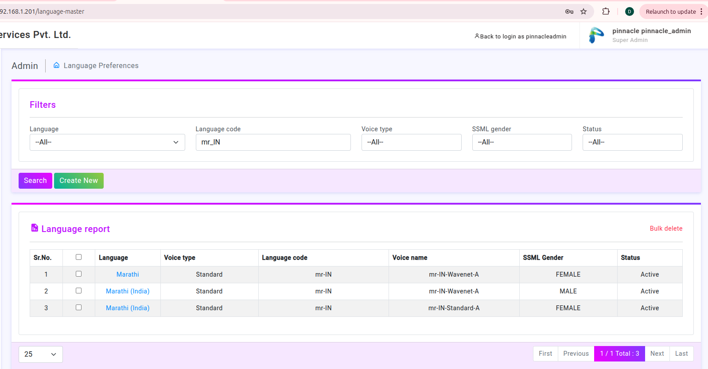
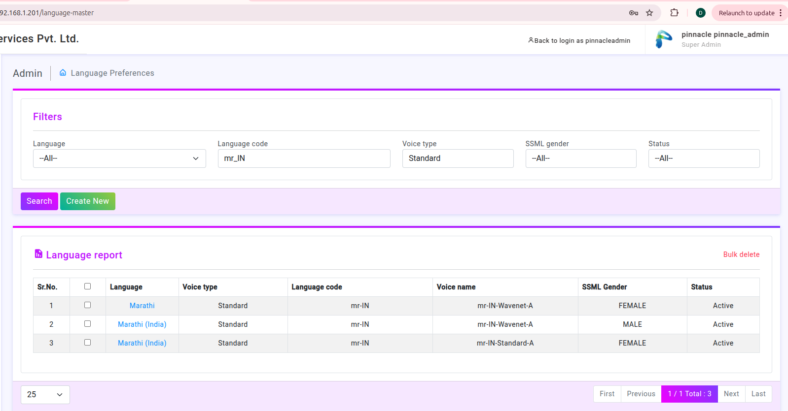
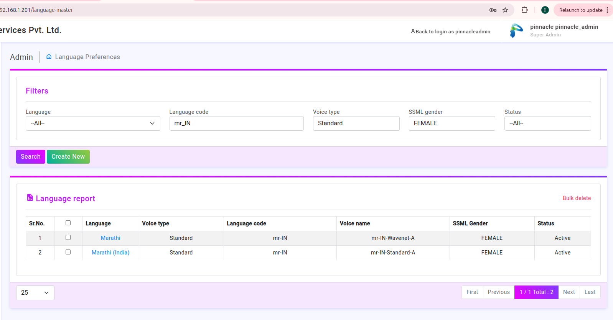
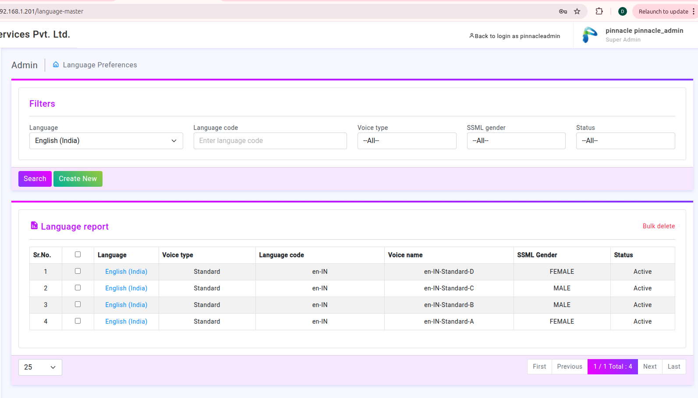

#  Language Prefernce Introduction

Create new :

While Creating language there are 5 required below field :

### 1.Language : 
This field specifies the name of language to be added.

### 2.Voice Type : 
This field specifies the type of voice which help to 	convert text-to-speech ,
          So this field include 2 options basically:
        i . Statndard:- Basic Voice
        ii . neural :- It contain more natural and human like voice

### 3.Language Code :- 
This is the unique code which represents the 							  language in the system.
                 It follows the ISO standard with country code.
                 Example : - if language = Maratrhi then ,
Language code = mr-IN , here In stands for the INDIA

### 4.Voice Name :- 
It specifies actual voice profile which used for speech 					synthesis example : - mr-IN-Wavenet-A

### 5.SSML Gender :- 
It determines the gender of voice which used for 						converting text-to-speech.
Example : MALE, FEMALE

### 6.Active :-
 Language is available to use in the system 

 
We can edit the language preference

In the filter section there are many other languages in the dropdown :

1.Filter According to Language :

    When we select Language as the English , So we able to show list of all records which has English language.

2.Filter Data According to Language Code .

3.Filter According to Voice type.

4.Filter Data According to SSML Gender. 

5.Filter according to Status 

