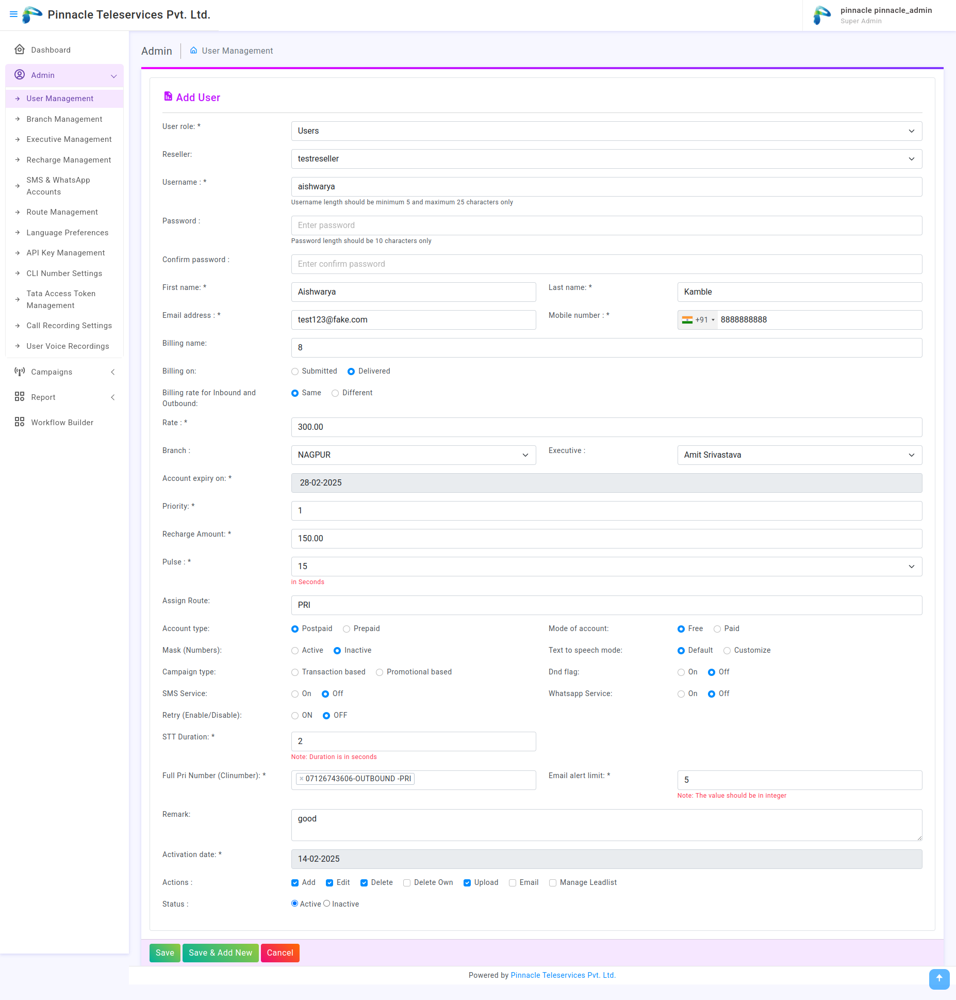
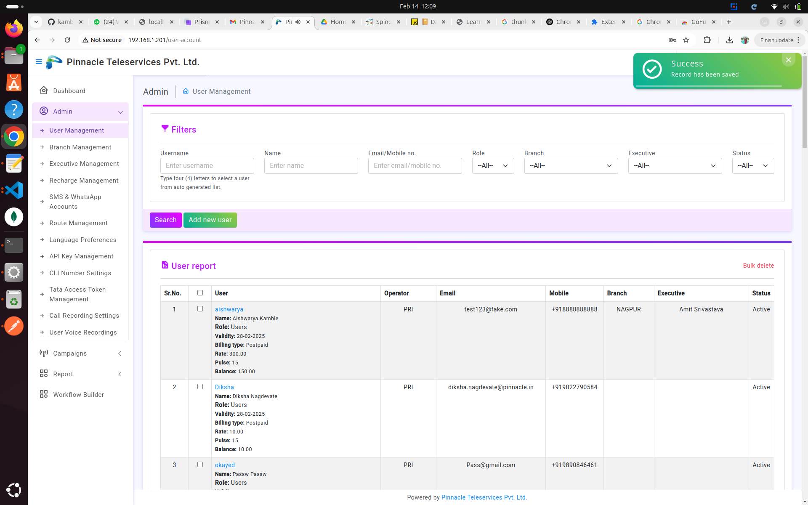
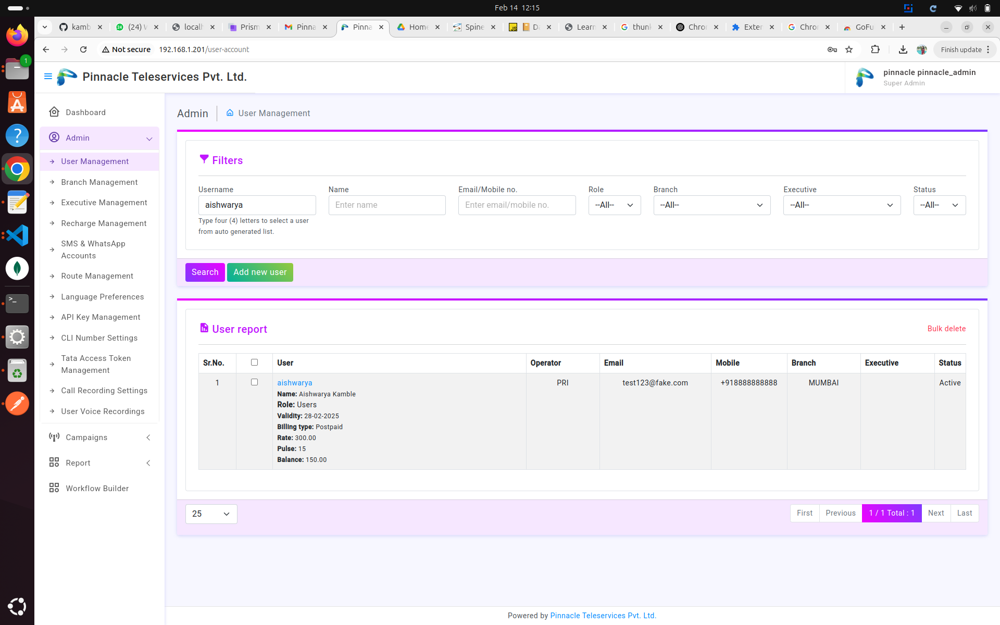
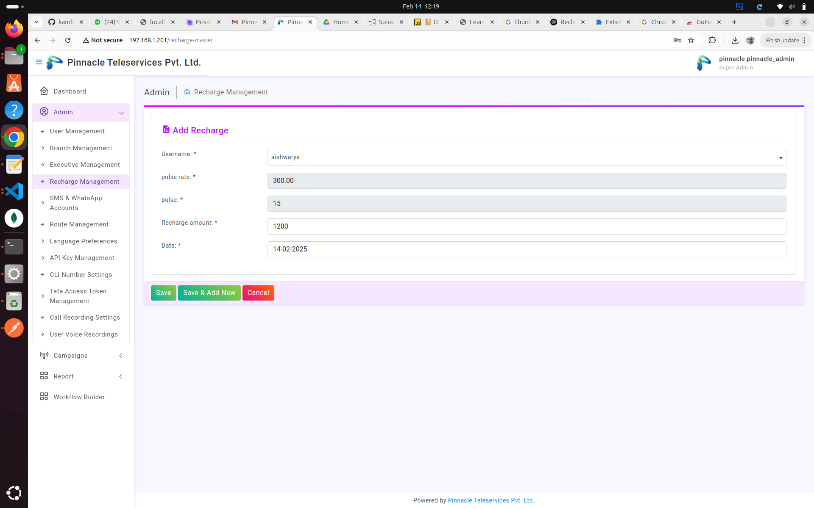
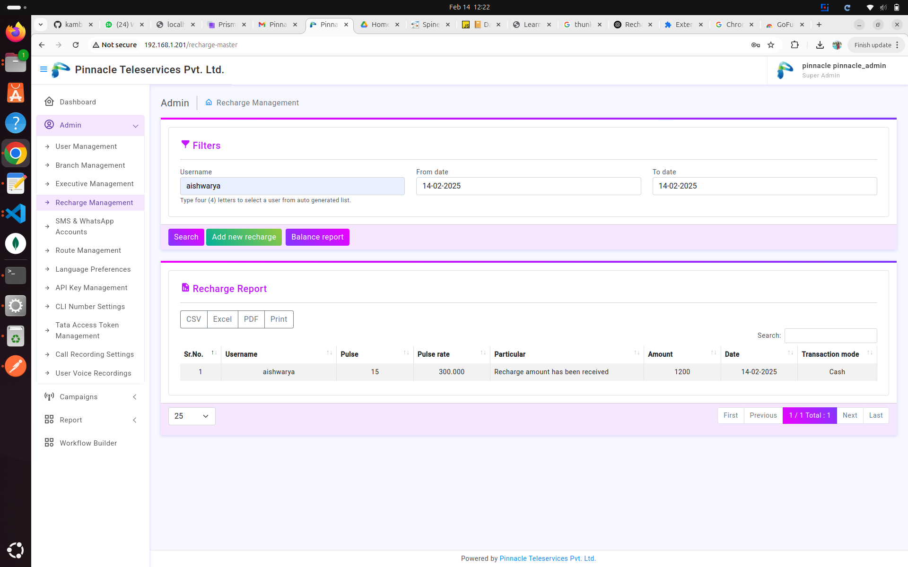
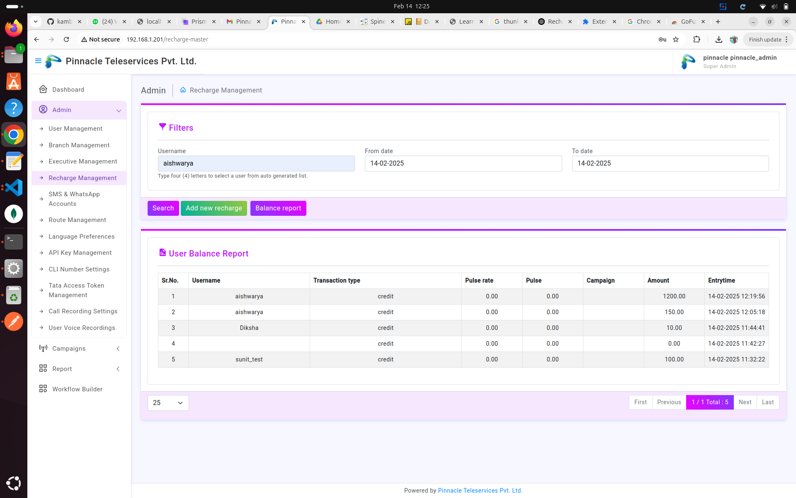
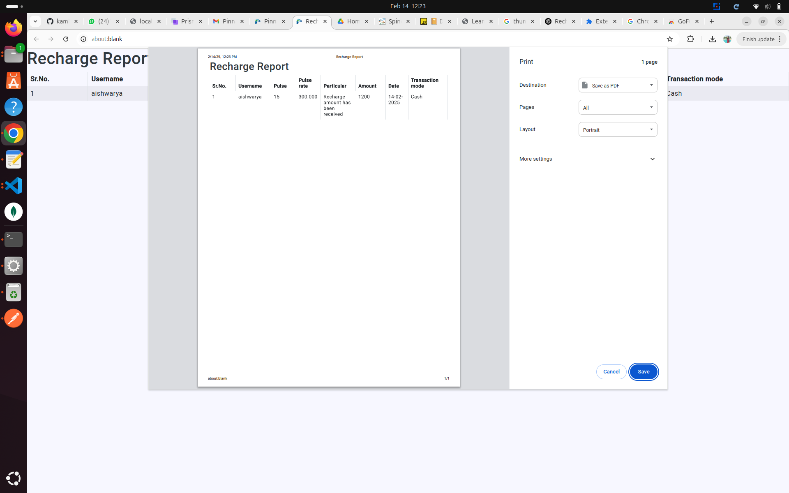

# Recharge Management Process

## **1. Log in as Super Admin**
Log in to the **admin panel** using your **super admin credentials** to access the recharge management features.

---

## **2. Add a New User**
To add a new user:

1. **Add user information**, including:
   - **Account Type**: Postpaid / Prepaid
   - **Mode of Account**: Free / Paid
   - **Campaign Type**: Select the campaign type.
   - **Varying Rates for Calls**: Set different rates for **inbound** and **outbound calls** if needed.
   - **Call Retry Settings**:
     - Define the **maximum retries** for failed calls.
     - Set the **retry interval** (e.g., retry after 10 minutes if the first call fails).

2. **Example**:
   - **Username**: `aishwarya@pinnacle`

   

   


---

## **3. Search & Manage Users**
To manage user details:

- **Search for a user** by **username** to view their details.

   


- Click **Edit** to modify user information. Update fields such as:
   - **Branch Name**
   - **Phone Number**
   - **Other user details**



---

## **4. Add a Recharge for the User**
To add a recharge for the newly created user:

- **Select the created user** from the dropdown menu.
- **View the default pulse rate** and **pulse value** set during user creation.




---

### **Pulse**
**Definition**: A fixed time duration for which a call is charged.

**Example**: If the pulse = **15 seconds**, the call will be charged in **15-second blocks**.

### **Pulse Rate**
**Definition**: The cost per pulse unit.

**Example**: If the pulse rate = **₹0.50**, then every **15-second block** costs **₹0.50**.

### **Recharge Amount**
**Definition**: The balance added to the user's account.

**Example**: If the recharge amount = **₹100**, the user can make calls until this balance is used up.

---

- The **recharge amount** and **date** are added when performing the recharge.
- After reviewing the details, click **Save** to successfully add the new recharge.

---

## **5. Search & View Recharge Reports**
To search and view the recharge reports:

- **Filter by username** to find recharges added for a specific user.



---

### **Export Report**
- You can **download** the recharge report in various formats:
  - **CSV**
  - **PDF**
  - **Excel**

- Alternatively, you can **print** the report directly.



---


## **Flowchart**

```mermaid
graph TD;
    A[Start] --> B[Login as Super Admin];
    B --> C[Add New User];
    C --> D[User Added Successfully];
    D --> E[Search User by Username];
    E --> F[Edit User Information (Branch Name, Phone Number, etc.)];
    F --> G[Save Updated User];
    G --> H[Select User for Recharge];
    H --> I[Get Default Pulse Rate and Pulse Value];
    I --> J[Enter Recharge Amount and Date];
    J --> K[Save Recharge];
    K --> L[Recharge Added Successfully];
    L --> M[Search Recharge in Report by Username];
    M --> N[Download Report (CSV, PDF, Excel) or Print];
    N --> O[End];

