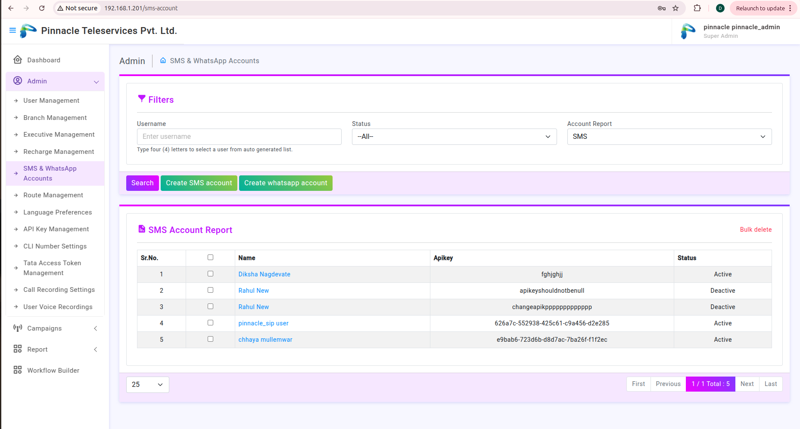
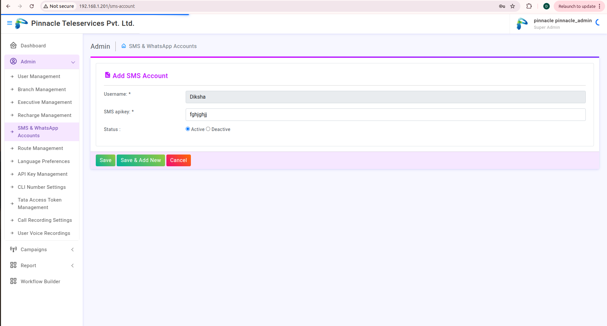
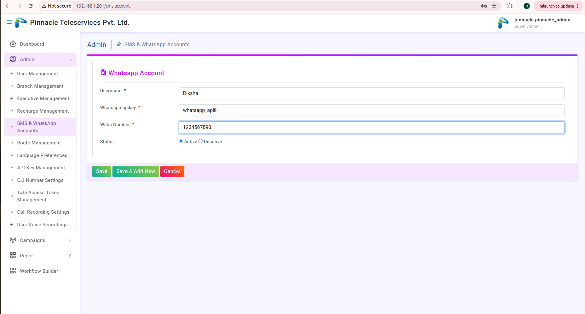
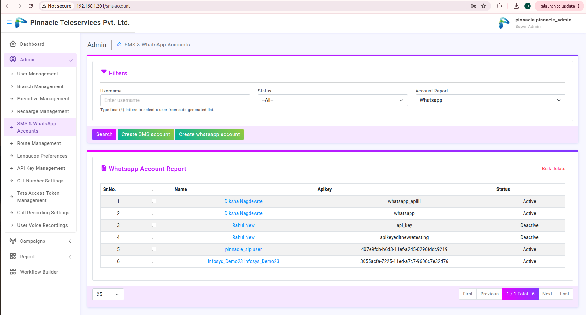

#  SMS and WhatsApp Introduction

This module is all about the Creating SMS and WhatsApp Account,So mainly it includes 2 section :

    ### 1. Create SMS Account : 
    While creating an SMS Account first we should create a user         account and then we create and SMS Create Account.

    So,for Creating SMS Account we want SMS apikey so for this we hold campaign for template approval after approving template of SMS we got an SMS apikey,So with the help of the SMS key and user we can create SMS Account.

    ### 2. Create Whatsap Account: Same for Creating WhatsApp Account we need WABA number and whatsap apikey which generate after campaign held and template approved .
