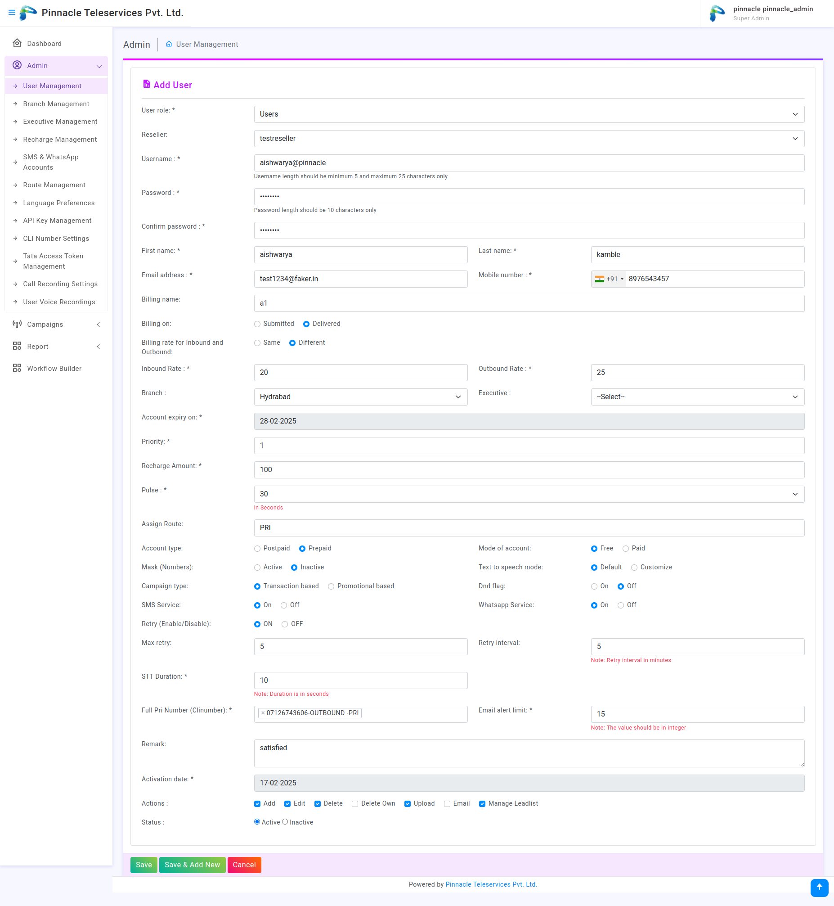
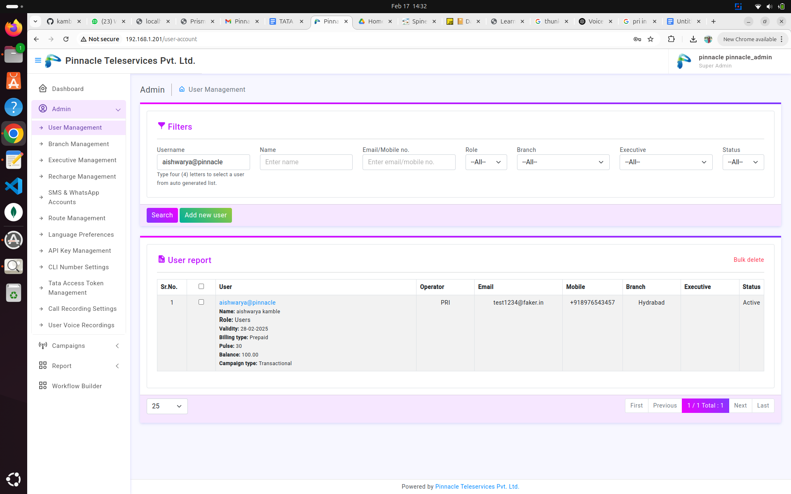
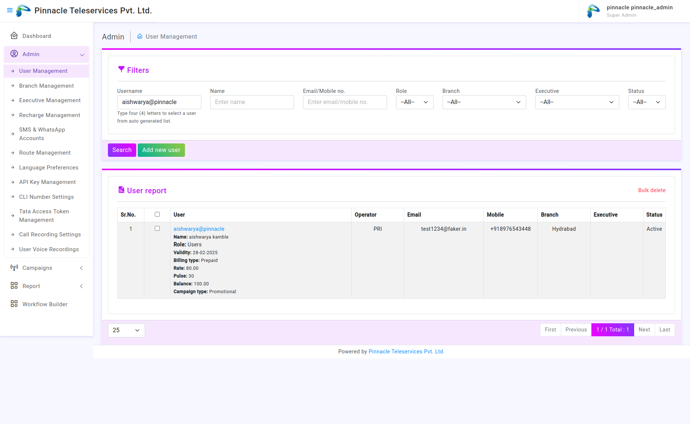
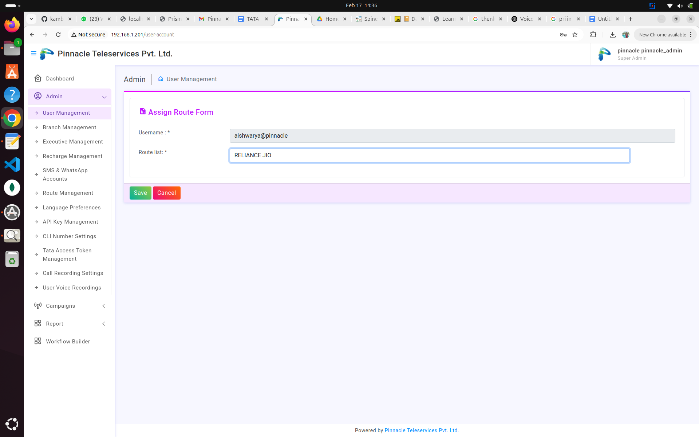
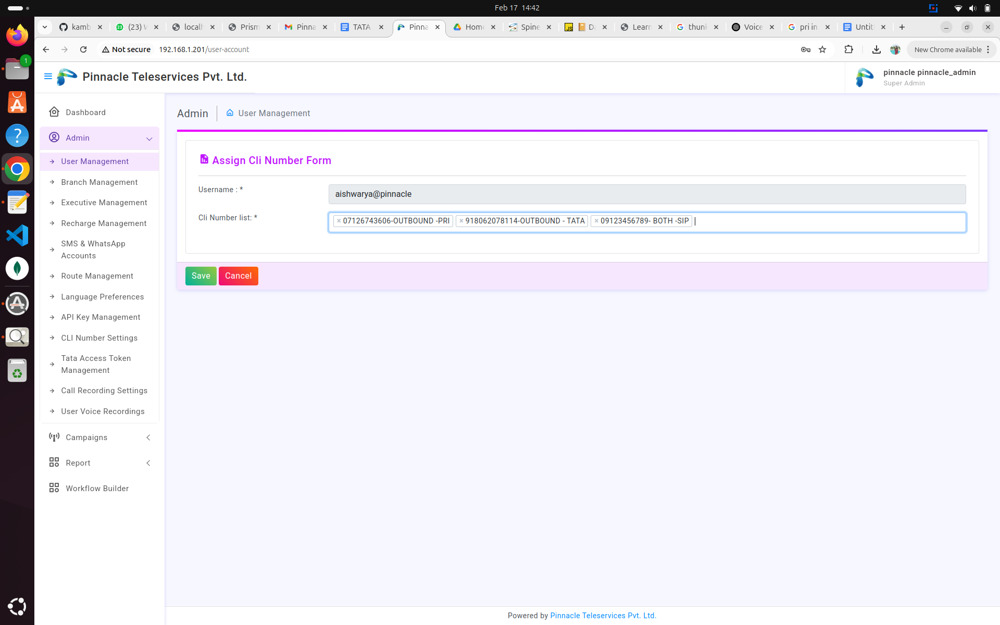
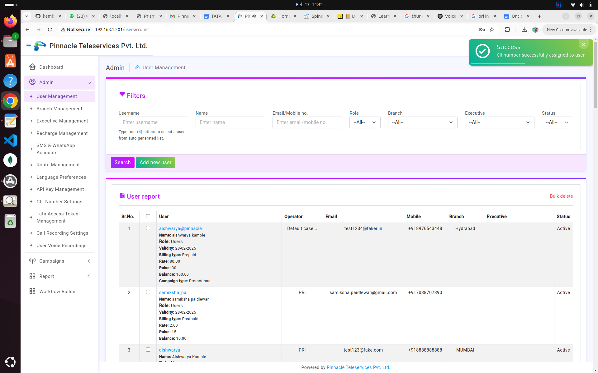
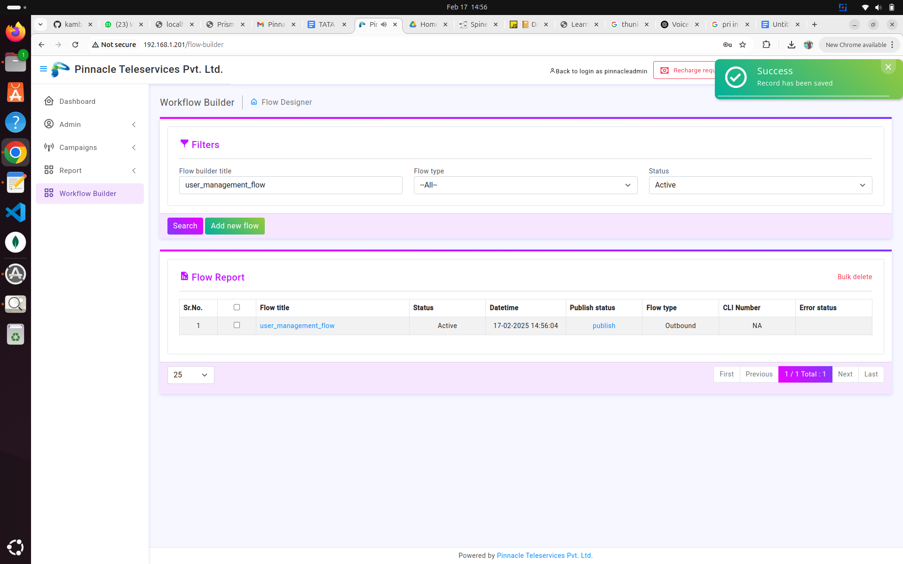
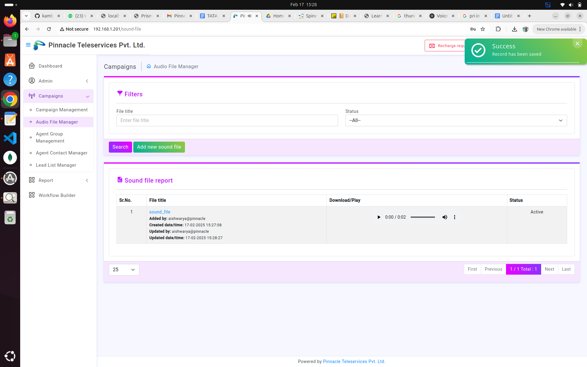
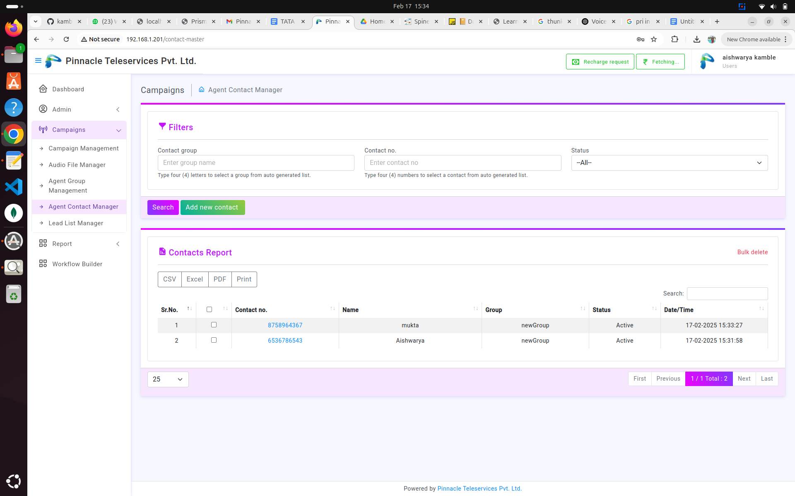
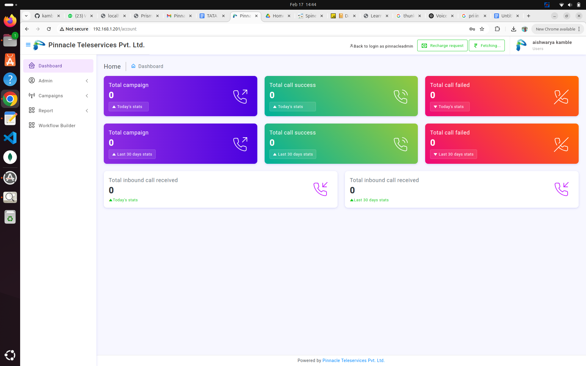

# User Management Process

## **1. Login as Admin**
Log in to the **admin panel** using your **admin credentials** to access user management features.

---

## **2. Create a New User**
Follow these steps to create a new user:

1. **Add user information**, including:
   - **Account Type**: Postpaid / Prepaid
   - **Mode of Account**: Free / Paid
   - **Campaign Type**: Select the campaign type.
   - **Varying Rates for Calls**: Set different rates for **inbound** and **outbound calls** if needed.
   - **Call Retry Settings**:
     - Define the **maximum retries** for failed calls.
     - Set the **retry interval** (e.g., retry after 10 minutes if the first call fails).

2. **Example**:
   - **Username**: `aishwarya@pinnacle`



---

## **3. Search & Manage Users**
To manage user details:

- **Search for a user** by **username** to view their details.
  


- Click **Edit** to modify user information. Update fields such as:
   - **Campaign Type**
   - **Contact Number**
   - **Other user details**



---

## **4. Assign Route**
Assign a route to the user:

- **Assign a Route** (e.g., Vodafone, STI, TATA, etc.). Choose from the available routes or create a new route if needed.




---

## **5. Assign CLI (Calling Line Identification)**
To assign CLI:

- **Assign CLI** from the available CLI list.




---

## **6. Additional Configurations**
Configure additional settings:

- **Add Call Flow**: Define the call handling process.



- **Upload a Sound File** (for voice campaigns).



- **Add Contacts**: Add contacts manually or via file upload.



---

## **7. Login with the Newly Created User**
1. **Log out** from the Admin account.
2. **Log in** using the newly created user credentials.
3. **Verify** that the user can log in successfully.



---

## **Flowchart**
Here's a flowchart representing the **User Management Process**:

```mermaid
graph TD;
    A[Start] --> B[Login as Admin];
    B --> C[User Management];
    C --> D[Create New User];
    D --> E[Fill in Account Type, Mode, Campaign, Retry Settings];
    E --> F[Save User];
    F --> G[Search User];
    G --> H[Edit User Info];
    H --> I[Assign Route & CLI];
    I --> J[Add Call Flow];
    J --> K[Upload Sound File];
    K --> L[Add Contacts];
    L --> M[Logout];
    M --> N[Login as New User];
    N --> O[Verify Successful Login];
    O --> P[End];
