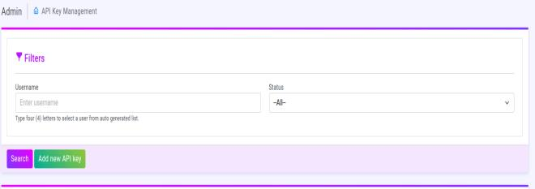
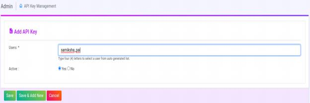
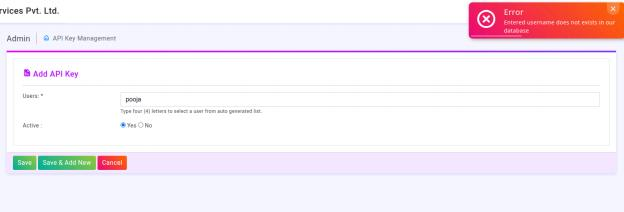
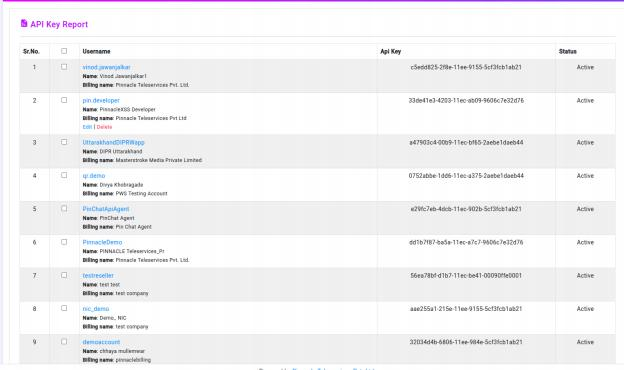
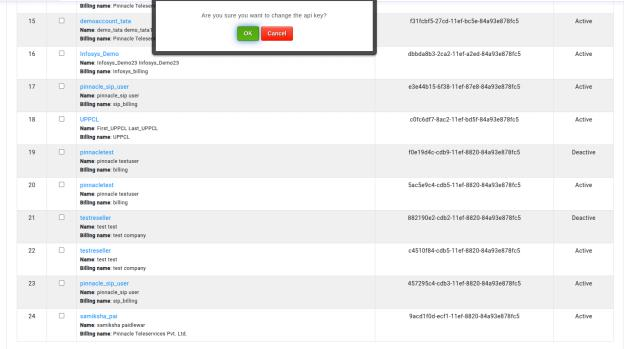
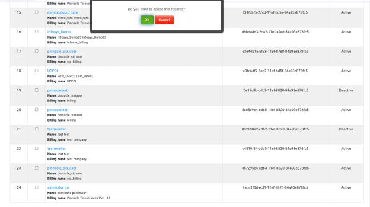

# Introduction to API-Key-Management

This module allows to manage API keys for different users. It provides
filtering, searching, and adding new API keys functionalities. The API keys are uniquely generated and assigned to users for authentication and
authorization.

--
Filters Section
--

Allows filtering API keys based on:

Username: 
--
Admin can enter a username to find a specific user’s API key.

Status:
--
Dropdown to filter API keys by status (Active, Inactive, etc.).

Search Button: 
--
Fetches databased on filter criteria.

Add New API Key Button:
--
Generates and assigns a new API key to a user.

Users: 
--
type your user name in this text field.

Active:
--
 A field containing two radio buttons that allow users to select "Yes" or "No" to indicate if they are active.

Save:
--
 Pressing the save button saves the data appropriately.

Save & add new :
--
It likely saves the current changes and then redirects to a blank "Add API    Key" form, allowing the administrator to immediately add a new users after updating the current one.

--
Cancel: Cancels the add operation, discarding any changes.

When the "Add New API Key" button is clicked:

The system generates a unique API key using encryption (UUID, hash functions, or token-based generation)
The API key is stored in the database with the associated username and
status.

If the user is not in the database, we are unable to produce an API key for them, the error message appears as seen in the above image.
This API key was successfully generated, and the user is listed in the database.

Api key reports :
--

Displays a list ofAPI keys with details:
●  Sr. No.: Serial number.
●  Username: User associated with the API key.
●  API Key: The unique API key assigned to the user.
●  Status: Indicates if the key is Active or Inactive.

In this report also there is two option available for edit and delete

Edit :
--

First, go to the specific users edit button. If we click the edit button, we will  see the message "Are you sure you want to change this api key?" If we click  the OK button, a new api key will be generated for this specific user. So, this new API key replaces the current one.

Delete :
--

The delete option deletes the specified record for this user. First, it displays a pop-up window that asks "Do you want to delete this record?" If we click the OK button, this record is deleted.

