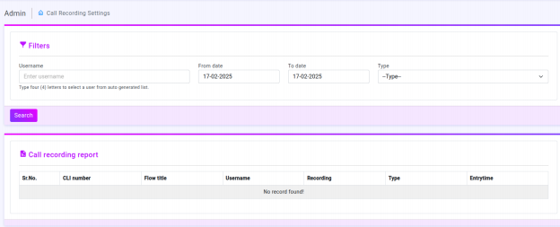
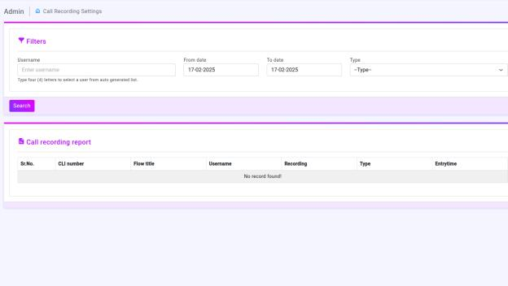
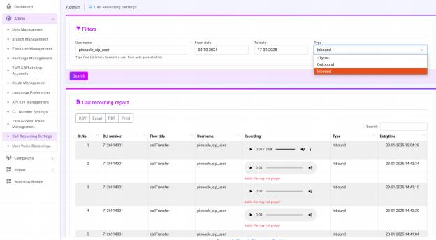
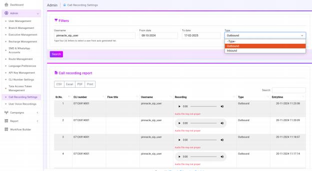

# Introduction to call-recording setting

This interface is part of an Admin Dashboard for Call Recording Settings that allows users to filter and view call recordings

● Filters Section: 
--
Allows filtering by Username, Date Range, and Type (Inbound/Outbound).

● Search Button: Fetches results based on the filters.

Filtering Calls :
---
The user can enter a Username, select a Date Range, and choose a Call Type (Inbound/Outbound).
Clicking the Search Button fetches call recordings matching the criteria.

Call recording report :
----

●  Call Recording Report Table: Displays details of recorded calls, including CLI Number, Flow Title, Username, Recording Player,  Type, and Entry Time.

●  If a file is missing or corrupted, an error message like "Audio file may not proper" is shown.

●  Export & Print Options: CSV, Excel, PDF, and Print buttons for exporting reports.

Call recording inbound report :
-----

●  Call Recording Report Table: Displays details of recorded calls, including CLI Number, Flow Title, Username, Recording Player,  Type, and Entry Time.

●  If a file is missing or corrupted, an error message like "Audio file may not proper" is shown.

●  Export & Print Options: CSV, Excel, PDF, and Print buttons for exporting reports.

Call recording outbound report :
----

●  Call Recording Report Table: Displays details of recorded calls, including CLI Number, Flow Title, Username, Recording Player,  Type, and Entry Time.

●  If a file is missing or corrupted, an error message like "Audio file may not proper" is shown.

●  Export & Print Options: CSV, Excel, PDF, and Print buttons for exporting reports.

