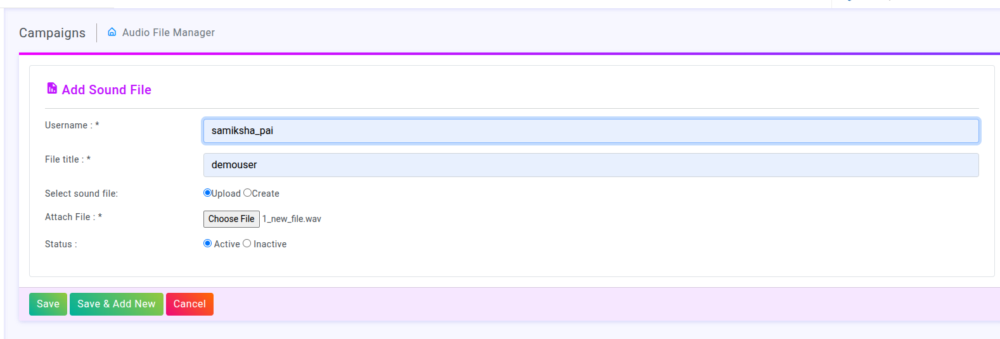
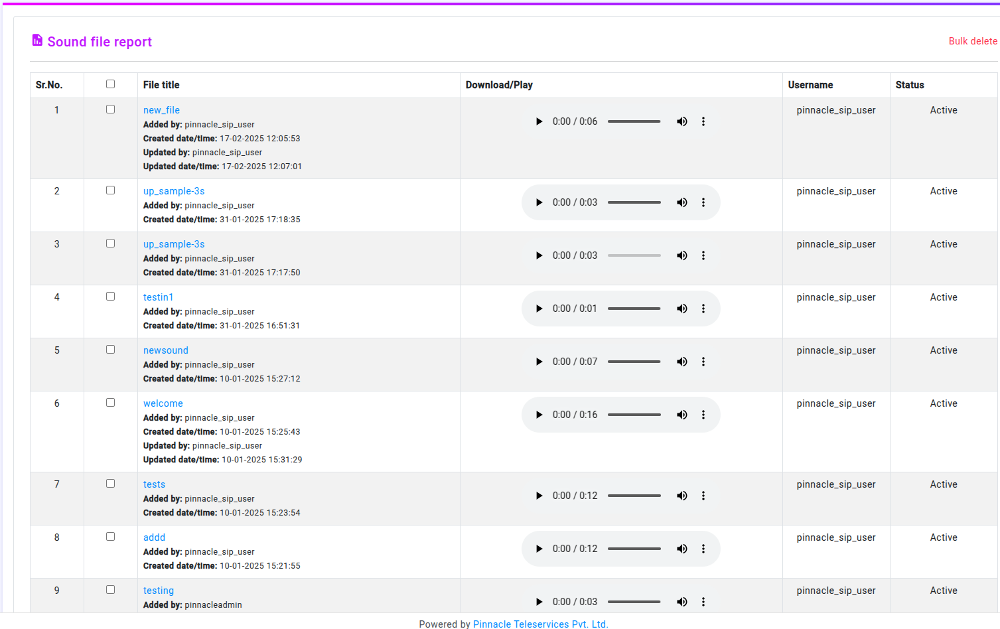
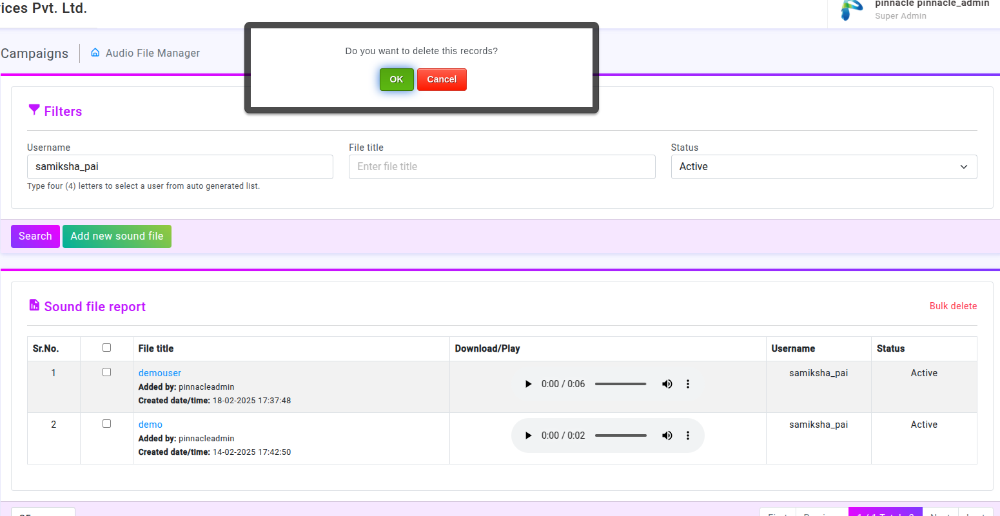
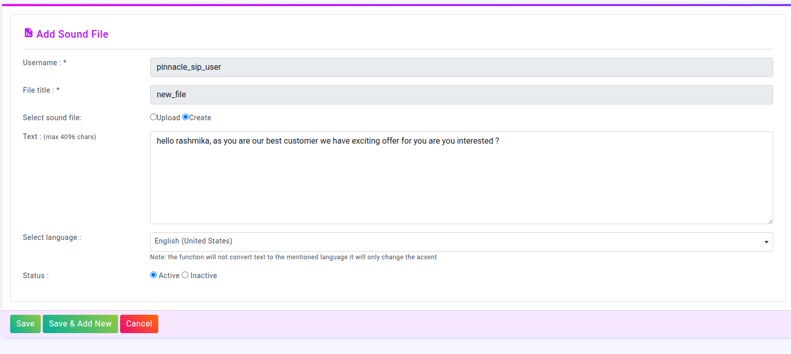

# Introduction to Audio File Manager

# Overview
The Audio File Manager interface allows users to upload, manage, filter, play, and download audio files. It includes functionalities for searching, adding new sound files, and bulk deletion of files.

 # Filters Section

### Purpose: 
Helps users search for specific audio files based on criteria.

# Fields Available:
### Username: 
Input field for entering a username (Auto-suggest feature enabled).

### File Title: 
Input field for entering the file name.

### Status:
 Dropdown with options (--All--, Active, Inactive).

# Buttons:
### Search:
 Executes the filter query.

### Add new sound file:
 Opens a form to upload a new sound file.

# Username :

### Input Type: 
Text (Auto-suggest may be enabled).
### Description:
The username of the person uploading the file.
Must be a registered user in the system.
Used for tracking who added or modified the file.
### Validation:
Must be at least 4 characters long.
Should match an existing username in the system.
Can contain letters, numbers, and certain symbols (e.g., _).

# File Title 
### Input Type: 
Text feild
### Description:
A name given to the sound file for easy identification.
Helps users locate the file in search and reports.
### Validation:
Should not be empty.
Can include letters, numbers, underscores, and spaces.
Must be unique (no duplicate titles for different files).

# Select Sound File 
### Input Type: 
File Upload (Only audio files)
### Description:
Allows users to browse and select a sound file from their computer.
Once selected, the file will be displayed in the Attach File field.
### Validation:
Only audio formats allowed (e.g., .wav, .mp3, .ogg).
File size should not exceed the system limit (e.g., 10MB).
Must be a valid audio file (not corrupt).

#Upload / Create (Button)
### Input Type:
 Button (Triggers file upload).
### Description:
Submits the form and uploads the selected audio file.
Sends the data (Username, File Title, File) to the backend.
Stores the file in the database or a storage location.
### Functionality:
On click, validates all fields.
Displays an error if any required field is missing.
If successful, updates the "Sound File Report" table with the new entry.

# Attach File 
### Input Type: 
Read-only Text

### Description:
Displays the name of the selected file after it's chosen.
Confirms which file is being uploaded.

# Status
### Input Type:
 Dropdown (Active / Inactive).
### Description:
Defines the availability of the uploaded file.
### Active:
 The file is available for playback and use.
### Inactive: 
The file is stored but hidden from playback/search.
### Functionality:
Default value is Active.
Users can change it based on file status preference.

# Process Flow
User enters their Username.

Provides a File Title.

Clicks Select Sound File and chooses an audio file.

The selected file appears under Attach File.

Sets the Status (Active/Inactive).

Clicks Upload/Create, which:

Validates input fields.

Uploads the file.

Saves file details to the system.

Displays the file in the "Sound File Report" section.

# Sound File Report

### Purpose:
 Displays uploaded audio files with details.

 

 ### Sr. No.: 
 Serial number of the file.

 ### File Title: 
 Name of the audio file (clickable).

 #### Additional Details per File:

###### Added by:
 The username of the person who uploaded it.
##### Created date/time: 
When the file was uploaded.
##### Updated by: 
If updated, the user who modified it.
##### Updated date/time: 
Last modification timestamp

### Download/Play: 
Embedded audio player for previewing sound files.

### Username:
 The user who uploaded the file.

### Status: 
Indicates if the file is Active or Inactive.

### Bulk Delete Option: 
Allows users to select multiple files and delete them at once.

### Delete:
Allows Users to delete the existing audio files

# Edit:
The "Edit Sound File" feature allows users to modify existing sound file records. Users can update file titles, replace sound files, change status, and edit associated text descriptions.

# Fields

### Username (Read-Only): 
Displays the uploader’s name.

### File Title: 
Editable, must be unique and not empty.

### Attach New File (Optional): 
Accepts .wav, .mp3, .ogg (Max: 10MB).

### Text Description: 
Editable, max 4096 characters.

### Select Language: 
Updates accent but doesn’t translate text.

### Status:
 Active (visible) or Inactive (hidden).

### Update Button:
 Saves changes after validation.