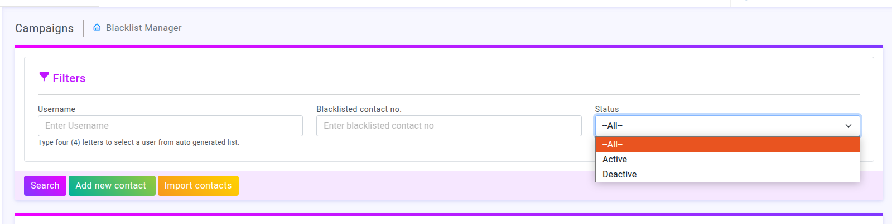
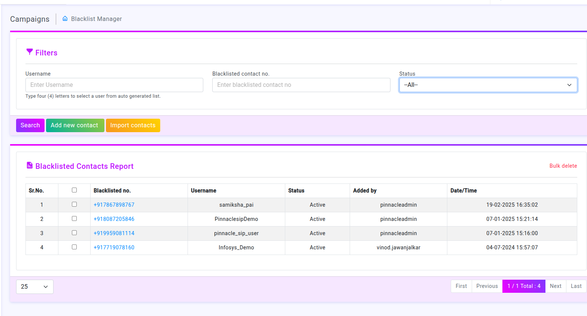
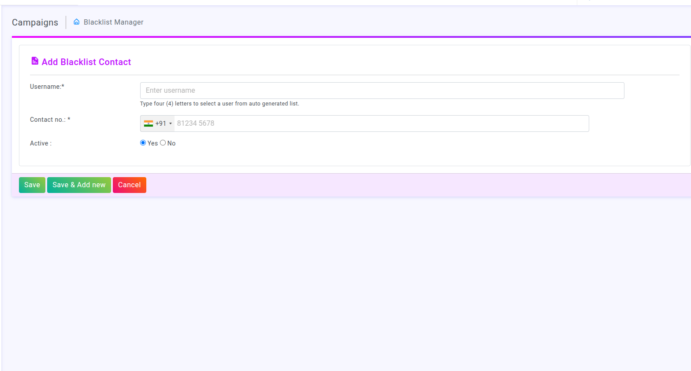
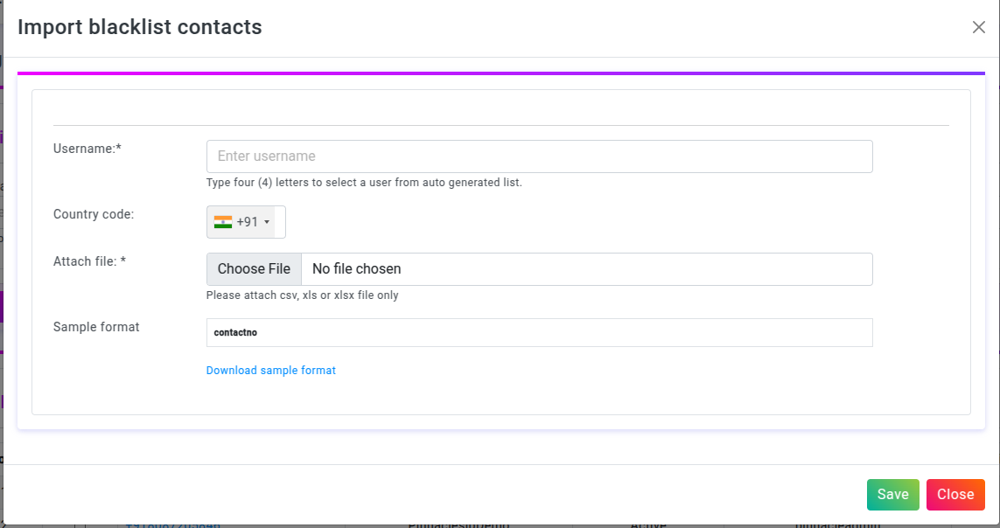

# Introduction to Black-List Manager

### Overview

The Blacklist Manager module is designed to manage and monitor blacklisted contacts within a Campaigns system.

#### Purpose: 
To enable precise searching and filtering of blacklisted contacts.

#### Fields:

##### Username: 
Input field with a placeholder ("Enter Username"). Auto-suggests users after typing four letters.
##### Blacklisted Contact No.:
 Input for entering a specific blacklisted number.
##### Status Dropdown: 
Allows selection of status (e.g., "All," "Active," "Inactive").

#### Buttons:

##### Search: 
Styled with a vibrant purple (#d11cd8), triggers the search action.
##### Add New Contact: 
Green button (#29a846), likely opens a form/modal for manual contact addition.
##### Import Contacts: 
Yellow button (#ffc107), for bulk import, possibly via a file upload (e.g., CSV).

 ### Blacklisted Contacts Report Section:
##### Purpose:
 Displays the current list of blacklisted contacts in a tabular format.

##### Sr.No.: 
Serial number of each entry.
##### Checkboxes:
 Allows multi-selection of rows for batch actions (e.g., delete, update).
##### Blacklisted No.: 
Displays the phone number of the blacklisted contact.
##### Username: 
Shows the username associated with the contact.
##### Status:
 Indicates whether the contact is "Active" or otherwise.
##### Added By:
 Displays the admin or user who added the contact to the blacklist.
##### Date/Time: 
Shows the date and time when the contact was added.

### Add Blacklist Contact Form:

#### Purpose: 
To allow users to manually add a new contact to the blacklist

#### Form Fields:
##### Username:

##### Input Type:
 Text field with a placeholder ("Enter username").
##### Auto Suggestion:
 Prompts a list of usernames after typing four characters, improving user experience.
##### Validation:
 Required (* indicates mandatory).
 #### Contact No.:

##### Input Type:
 International phone number input field with a country code selector.
##### Example Shown:
 Indian number (+91), formatted input for easy usability.
##### Validation:
 Required (* indicates mandatory).
##### Active Status:

###### Input Type:
 Radio buttons (Yes / No).
Default Selection: Likely defaults to Yes, indicating active status unless manually changed.

### Action Buttons:
##### Save:
 Green button (#29a846) to save the contact to the blacklist.
##### Save & Add New: 
Pink button (#d11cd8) to save the current contact and reset the form for adding another contact.
##### Cancel:
 Red button (#ff5722) to exit the form without saving, likely navigating back to the previous screen

 ### import:

Import Contacts: Allows bulk import via file (e.g., CSV).