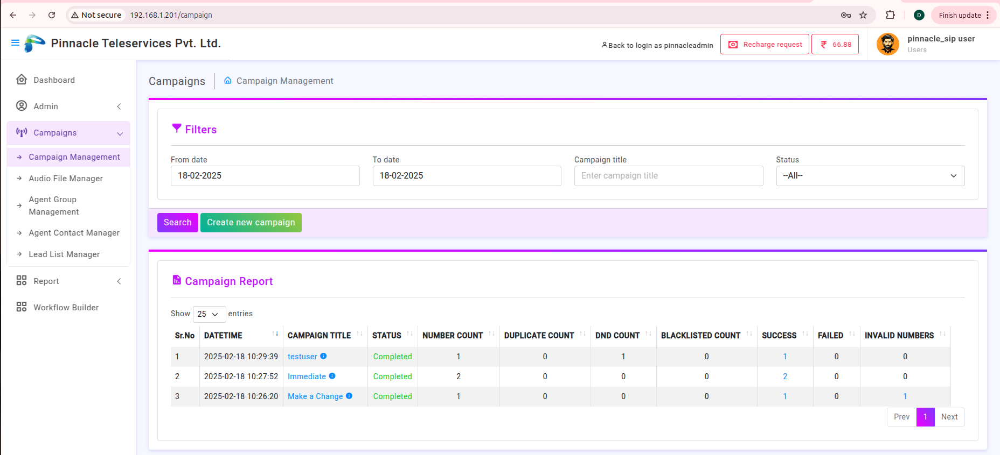

# campaign-management Introduction

# Campaign Management 

###  Create Campaign :
 Here we create campaign using below field

 #### 1. Scheduled campaign :
  In this field we scheduled campaign having 2 options :
    i. Immediate : The campaign starts immediately after creation.

    Example: If you select Immediate Schedule, the campaign will start as soon as it is created.

    ii. Scheduled : It scheduled campaign for allows setting a future date and time for the campaign.
 #### 2. Upload Type :
    It Defines how we add contacts for the campaign, So there are 2 type of upload :

    i. Add Few Contacts :  Manually enter a few numbers. If we select add few contact 
    ##### the mobile number field 
    is visible 
    ii. Bulk Contact Upload via CSV : Upload a CSV file containing multiple contacts. And if we select bulk upload 
    ##### choose file 
    option shows
    

    Example: If you choose Bulk Contact Upload via CSV, you can upload a file with thousands of numbers instead of entering them one by one.

#### 3. Campaign Mode : 
    Determines the type of campaign:

      1.Audio : Interactive Voice Response, where recipients receive an automated voice call.
      2. IVR : Interactive Voice Response
      Example:
        If you select Audio IVR, a pre-recorded message will be played to the recipients.

#### 4. Campaign Type : 
    Defines whether each recipient gets a unique or common message:

    i.Unique: Each recipient gets a personalized message.
    ii.Common: All recipients receive the same message.

    Example: If you select Common, all users will receive the same pre-recorded message.

#### 5. Select CLI Number :
    The Caller Line Identification (CLI) number is the phone number displayed when the call is made.

    Example: If you select 071269140, recipients will see this number as the caller ID.

#### 6. Campaign Title: 
The name of the campaign for internal reference.

#### 7. Audio :
The pre-recorded audio file(s) that will be played during the IVR call.

Example:If you select newsound, this is the audio message that will play when the call is answered.

#### 8. Allow Duplicate Number :
    1.Enabled: Allows the same phone number to receive the campaign multiple times.
    2.Disabled: Ensures each number is contacted only once.
    Example: If enabled, the same number (e.g., 9022790584) could receive multiple calls.

#### 9. Speech to Text :
    i.ON: Converts the provided text into a speech message.
    ii.OFF: Uses a pre-recorded audio file instead.
    Example: If ON, the system will read a text message instead of playing a pre-recorded file.

#### 10. Select Language :
    Specifies the language for Speech-to-Text messages.

    Example: If English is selected, the text will be converted to speech in an English voice.

#### 11. Mobile Number :
    Enter the phone numbers of the recipients.

    Numbers should not include country code (+91).
    Multiple numbers should be comma-separated.
    Example:If you enter 9022790584,7038707390, these two numbers will receive the campaign.

## Campaign Processing :
 There vare 3 stages 
 #### 1. Completed 
 #### 2. Pause 
 #### 3. Stop

