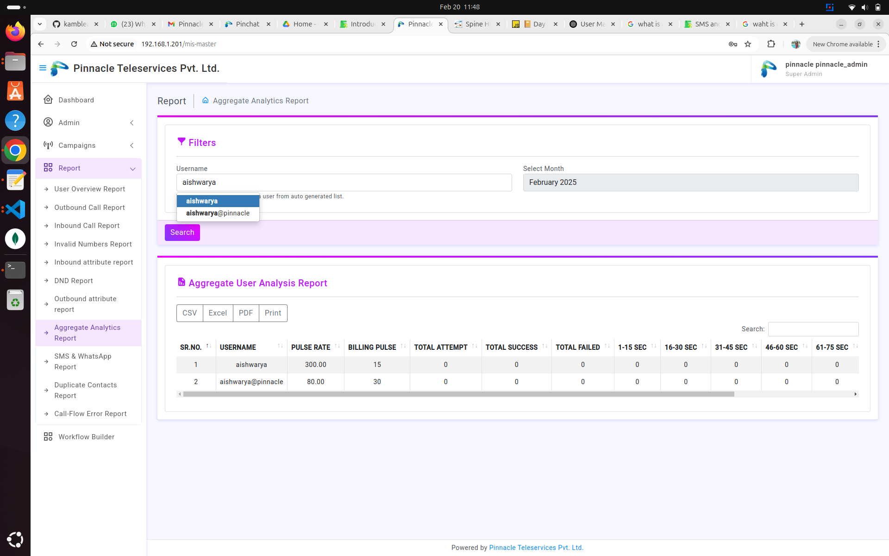

# Aggregate Analytics Report

## Steps to View the Report  

1. **Login as Admin**  
   - Enter correct credentials to access the system.  

2. **Search Report by Username and Date**  
   - Enter the **Username**.  
   - Select the **Month** and **Year** from the dropdown.  
   - Click on the **Search** button.  

      

3. **View the Report**  
   - If the entered **Username** and **Month-Year** are correct, the report will be displayed successfully.  
   - The report includes aggregated analytics based on the selected period.  

## Expected Behavior  
✅ If valid **Username** and **Month-Year** are provided → The report is displayed successfully.  

    

❌ If incorrect details are entered → No report is shown or an error message appears.  

