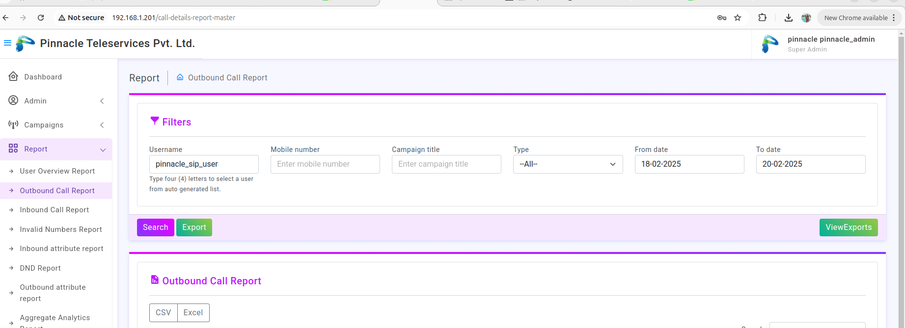
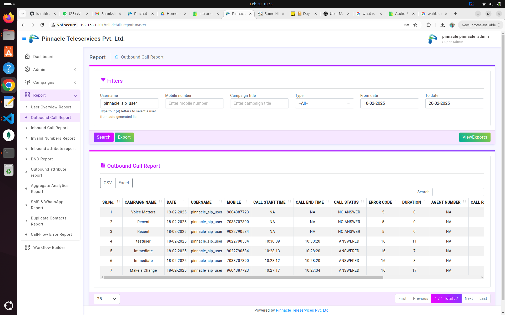

# Outbound Call Report Introduction

An Outbound Call Report is a document or system-generated summary that tracks details about outbound calls made by a team, department, or call center. It typically includes key metrics such as:

# **1. Login as Admin**

We can search outbound call report by typing username and entering from date and to date

Common Elements of an Outbound Call Report
Call Details

Date and time of the call
Duration of the call
Dialed number
Agent/employee making the call
Call Status

Answered / Unanswered
Busy / Voicemail / No Response
Disconnected / Dropped calls
Purpose of the Call

Sales / Follow-up / Customer Support / Survey
Outcome of the Call

Lead converted
Appointment scheduled
Issue resolved
Callback requested
Total Outbound Calls

Number of calls made per agent/team
Success rate of calls
Call Disposition (Final status after the call)

Interested / Not interested
Follow-up required
Wrong number
Uses of an Outbound Call Report
Sales & Marketing – Helps track lead conversion and follow-ups
Customer Support – Ensures timely resolution of customer issues
Performance Analysis – Evaluates agent productivity and efficiency
Compliance & Monitoring – Ensures adherence to call scripts and legal requirements

# **2. Outbound Report Generate Successfully**

After entered required details like username from date, to date we will get outbound report of that particular dates 

