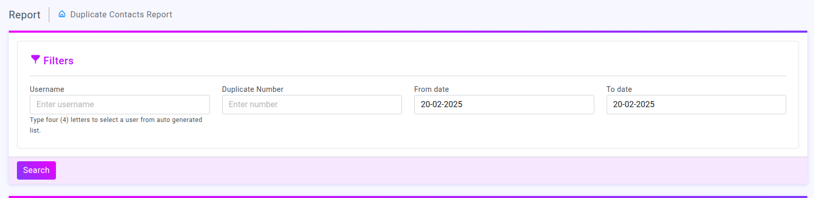
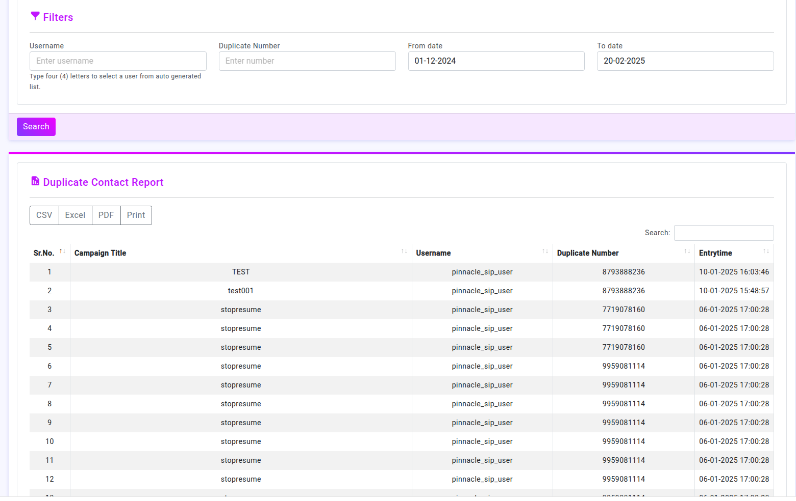

# duplicate contact report Introduction

## Filter

The filters section provides input fields to narrow down the search results

##### Username: 
Input field for the username. Autocomplete functionality is available after typing four characters.

##### Duplicate Number: 
Field to enter a specific duplicate number.

##### Date Range:
 Two date pickers for selecting the 'From date' and 'To date'.

##### Search Button:
 Initiates the search based on the input criteria.

##### Functionality

When the 'Search' button is clicked, the system fetches relevant data using the provided filters.

## Duplicate Contact Report

This section displays the search results in a structured table format

##### Sr. No.: 
Serial number of the entries.

##### Campaign Title:
 Name of the associated campaign.

##### Username:
 Displays the username associated with the duplicate number.

##### Duplicate Number:
 Shows the Duplicate phone number.

##### Entry Time:
 The timestamp of when the duplicate number entry was recorded.

##### Export Options:
 Provides buttons to download the report as CSV , PDF,Print or Excel files.