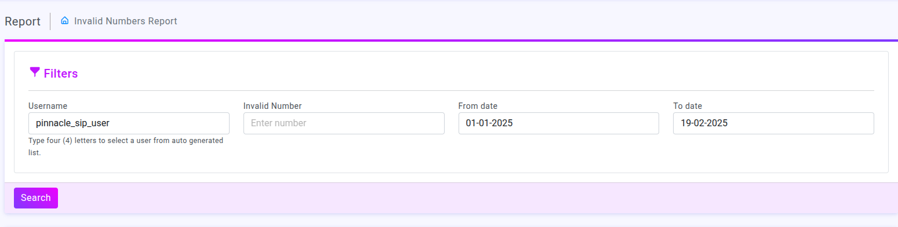
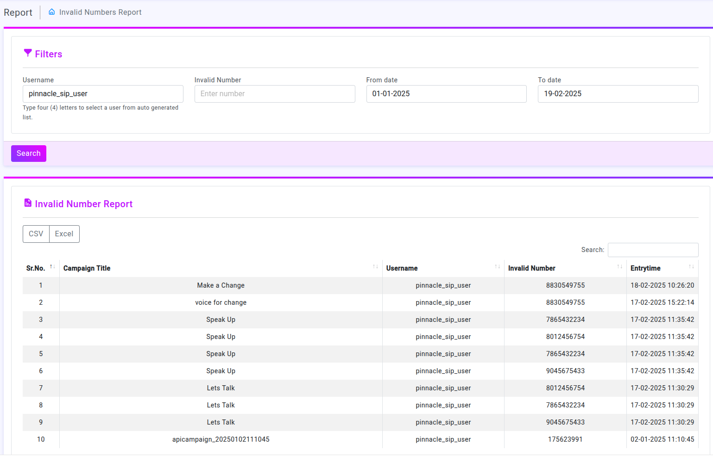

# Introduction to Invalid Numbers Report

### Overview

The "Invalid Numbers Report" page is designed to generate and display a report of invalid phone numbers associated with campaigns. It includes filtering options, a search functionality, and export options (CSV and Excel).

### Filters 

The filters section provides input fields to narrow down the search results

##### Username: 
Input field for the username. Autocomplete functionality is available after typing four characters.

##### Invalid Number: 
Field to enter a specific invalid phone number.

##### Date Range:
 Two date pickers for selecting the 'From date' and 'To date'.

##### Search Button:
 Initiates the search based on the input criteria.

##### Functionality

When the 'Search' button is clicked, the system fetches relevant data using the provided filters.

 ### Invalid Number Report Section

This section displays the search results in a structured table format

##### Sr. No.: 
Serial number of the entries.

##### Campaign Title:
 Name of the associated campaign.

##### Username:
 Displays the username associated with the invalid number.

##### Invalid Number:
 Shows the invalid phone number.

##### Entry Time:
 The timestamp of when the invalid number entry was recorded.

##### Export Options:
 Provides buttons to download the report as CSV or Excel files.