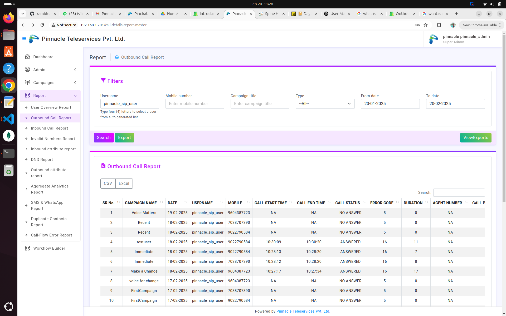

<!-- # SMS and Whatsapp Report -->

<!-- # SMS and WhatsApp Report -->

## Steps to View the Report  

1. **Login as Admin**  
   - Enter correct credentials to access the system.  

2. **Search Report by Username and Date Range**  
   - Enter the **Username**.  
   - Select **From Date** and **To Date**.  
   - Click on the **Search** button.  

   

3. **View the Report**  
   - If the entered **Username** and **Date Range** are correct, the report will be displayed successfully.  
   - The report includes details of **SMS and WhatsApp messages** sent during the selected period.  

      

## Expected Behavior  
If valid **Username** and **Date Range** are provided → The report is displayed successfully.  
If incorrect details are entered → No report is shown or an error message appears.  

